# GemX

GemX is an innovative application designed to provide users with dynamic and interactive responses based on their prompts. With features ranging from text and voice interaction to video calls and travel planning, GemX is your versatile AI companion.

## Features

- **Chat with GemX:** Engage in text-based conversations with the AI to get answers, information, or assistance on a wide range of topics.
- **Talk with GemX:** Use voice commands to interact with the AI, making it easy to ask questions or give commands hands-free.
- **Video Connect:** Start a video call with GemX, allowing you to show items to the camera and get real-time responses or advice.
- **Prompt Interaction:** Submit text or image-based prompts to receive tailored responses from the AI, with the option to refresh the result if unsatisfied.
- **TravelGenie:** Plan your perfect trip by entering destination, duration, budget, and number of travelers to generate a customized itinerary.
- **Share Chats:** Easily share your chat interactions with others via various sharing options.
- **Recent Searches:** View and revisit your recent searches or prompts for quick access.
- **User Profile:** Personalize your experience by managing your profile, including name, email, and logout options.

## Download

GemX is available for download on the Google Play Store. Click the icon below to get it now:

[](https://play.google.com/store/apps/details?id=your.app.package)


## Screenshots

| 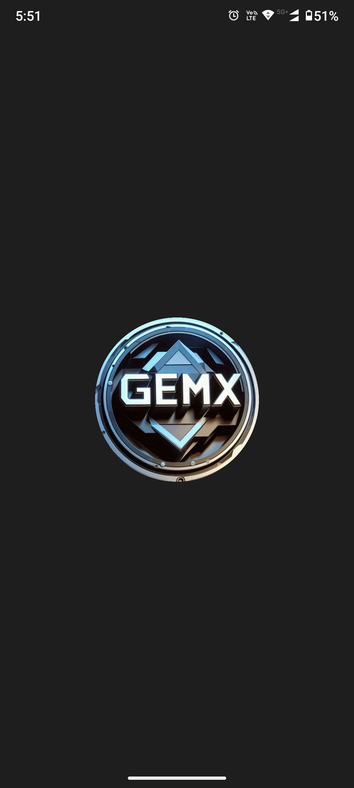 | 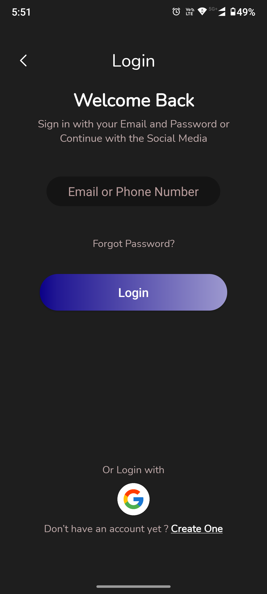 | 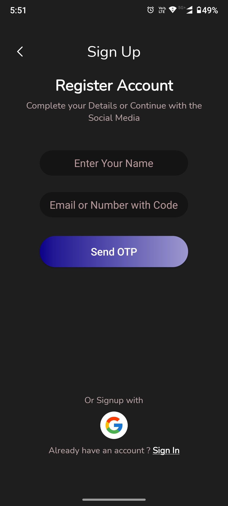 |
|:----------------------------:|:---------------------------:|:----------------------------:|
| 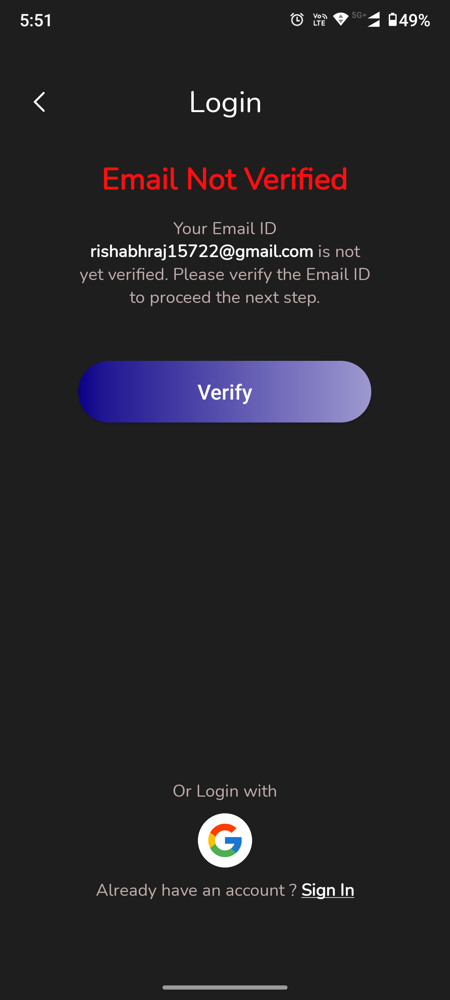 |  | 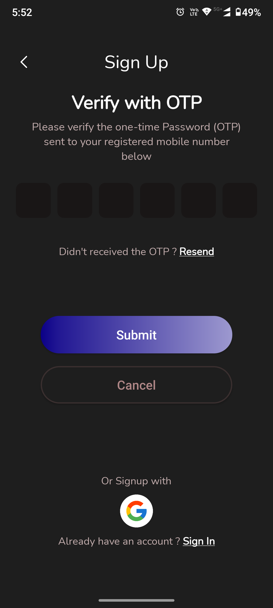 |
| 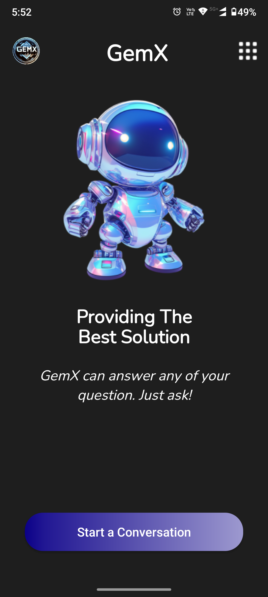 | 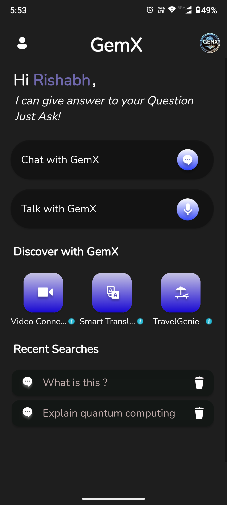 | 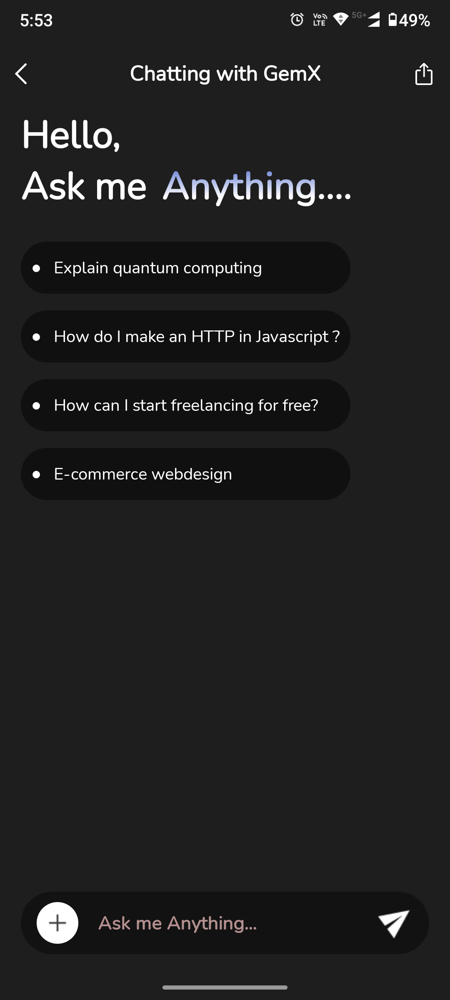 |
| 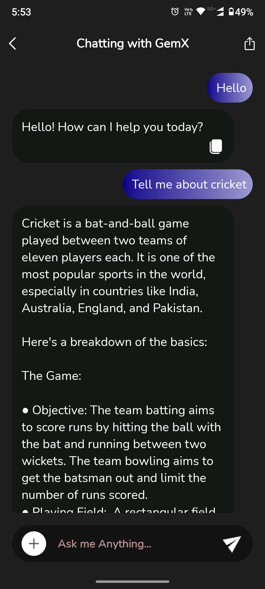 | 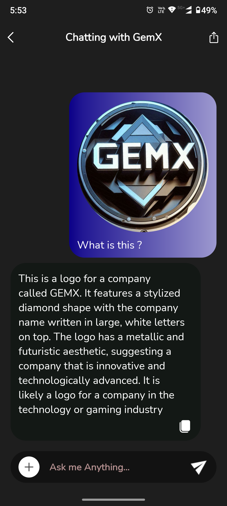 | 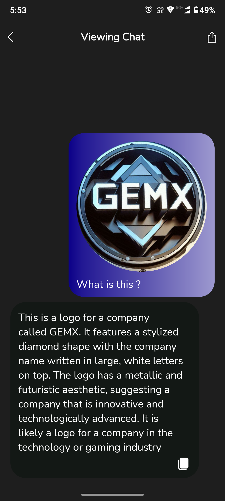 |
| 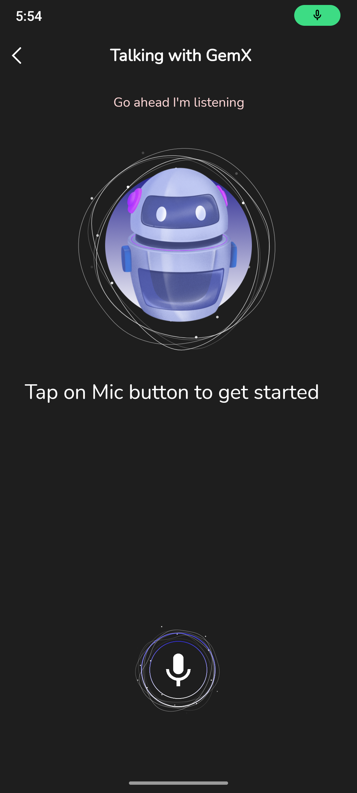 | 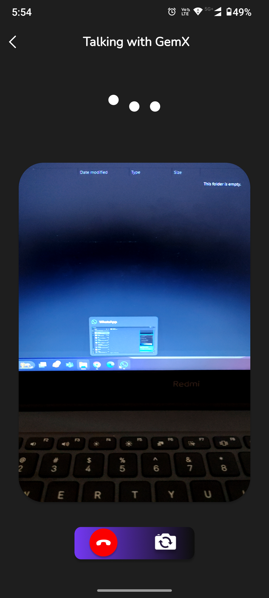 | 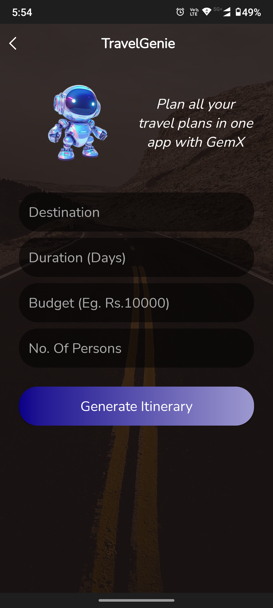 |
|  | 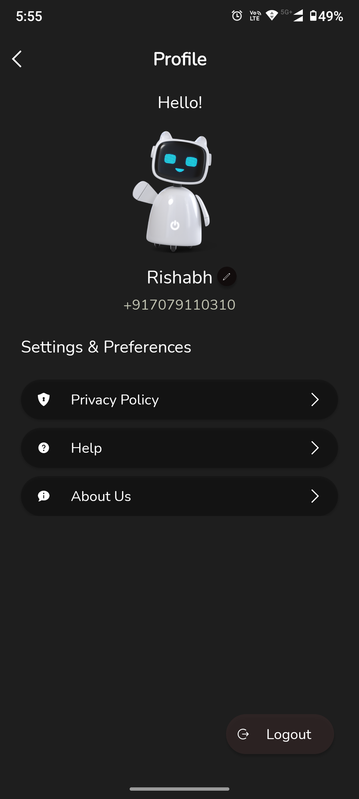 | 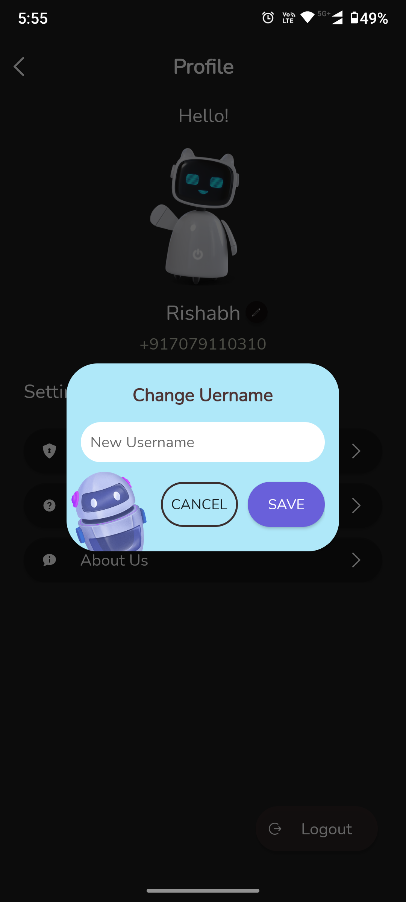 |

## Installation

To get started with GemX, follow these steps:

1. **Clone the Repository:**

    ```bash
    git clone https://github.com/Sunatqayoom/GemX.git
    ```

2. **Navigate to the Project Directory:**

    ```bash
    cd GemX
    ```

3. **Open the Project in Android Studio:**

    - Import the project into Android Studio by selecting `Open an Existing Project` and navigating to the cloned repository directory.

4. **Build and Run:**

    - Click on the `Run` button in Android Studio to build and run the app on an emulator or a physical device.


## Contributing

Contributions to GemX are welcome! If you'd like to contribute, please follow these steps:

1. **Fork the Repository:** Click on the `Fork` button at the top-right of this page.
2. **Clone Your Fork:** 

    ```bash
    git clone https://github.com/yourusername/GemX.git
    ```

3. **Create a Branch:** 

    ```bash
    git checkout -b your-feature-branch
    ```

4. **Make Changes:** Implement your changes or features.
5. **Commit and Push:** 

    ```bash
    git add .
    git commit -m "Add your message here"
    git push origin your-feature-branch
    ```

6. **Create a Pull Request:** Open a pull request on GitHub and describe the changes you've made.

## License

GemX is licensed under the MIT License. See [LICENSE](LICENSE.md) for more details.

## Contact

For any questions or feedback, feel free to open an issue on the GitHub repository or reach out to us at [gemxteam2024@gmail.com](mailto:gemxteam2024@gmail.com).
